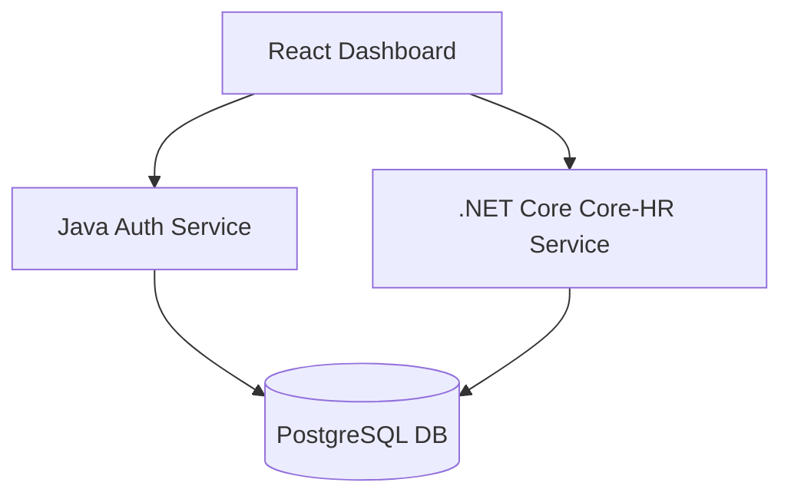

# 🏢 Modern Human Resource Management System (HRMS)

<div align="center">
  
  
  
</div>

<br />

<p align="center">
  <strong>An enterprise-grade HRM solution streamlining organizational workflows with precision and efficiency.</strong>
</p>

<p align="center">
  <a href="#-key-features">Key Features</a> •
  <a href="#-tech-stack">Tech Stack</a> •
  <a href="#-installation">Installation</a> •
  <a href="#-architecture">Architecture</a> •
  <a href="#-team">Team</a>
</p>

---

## 🌟 Project Highlights

> [!IMPORTANT]
> This project demonstrates a hybrid backend architecture using both **Java Spring Boot** and **.NET Core**, showcasing advanced integration of service-oriented architectures.

- **Dual-Stack Backend**: Seamlessly swap or integrate Java and .NET services.
- **Real-time Analytics**: Dynamic dashboards for managers and HR professionals.
- **Gamified Rewards**: Boost employee engagement through a token-based reward system.
- **Fully Containerized**: Ready for cloud deployment with Docker.

---

## 🚀 Key Features

### 👤 Core HR & Profile Management
- **Employee Self-Service (ESS)**: Securely view and update personal information (Address, Phone, Bank Account).
- **Comprehensive HR Dashboard**: HR professionals can monitor, add, and update employee lifecycle records and statuses.
- **Profile Auditing**: Detailed views of employee data to ensure information accuracy across the organization.

### 📅 Advanced Attendance & Leave System
- **Intelligent Timesheet**: Automated synchronization with timekeeping hardware to track work hours, overtime, and early/late arrivals.
- **Flexible Leave Requests**: Support for various leave types (Day, Half-day, Hourly) with balance tracking and progress monitoring.
- **Remote Work & Business Trips**: Specialized workflows for Work From Home (WFH) and Business Trip (Work Trip) approvals to ensure accurate attendance.
- **Attendance Correction**: Employee-driven correction requests for clock-in/out discrepancies with HR manual override capabilities.
- **Shift Management**: Peer-to-peer shift swap requests with managerial oversight.

### ⚖️ Approval Workflow & Delegation
- **Multi-Level Approvals**: Streamlined processing for leave, OT, WFH, and timesheet adjustments.
- **Audit Trails**: Complete history for every request including reasons, attachments, and detailed approval logs.
- **Authority Delegation**: Managers can delegate approval rights during absences to ensure zero disruption in workflows.

### 🏆 Points & Rewards Ecosystem
- **Automated Distribution**: Rule-based monthly point allocation based on employee roles.
- **Manager Recognition**: Direct "Spot Awards" where managers can gift points to high-performing team members.
- **Reward Monetization**: Flexible rule engine for converting accumulated points into cash or physical rewards.
- **Transparent Ledger**: Full visibility into point transaction history for both employees and administrators.

### 🏃 Corporate Activities & Engagement
- **Campaign Management**: HR can create, manage, and report on corporate events and wellness campaigns.
- **Participation Tracking**: Easy discovery and registration for company activities with real-time participation records.
- **Performance Analytics**: Comprehensive reporting on campaign success, including top participants and engagement metrics.

---

## 🛠️ Tech Stack

<table align="center">
  <tr>
    <td align="center" width="96">
      
      <br />React 19
    </td>
    <td align="center" width="96">
      
      <br />TypeScript
    </td>
    <td align="center" width="96">
      
      <br />Tailwind
    </td>
    <td align="center" width="96">
      
      <br />Spring Boot
    </td>
    <td align="center" width="96">
      
      <br />.NET 8
    </td>
    <td align="center" width="96">
      
      <br />PostgreSQL
    </td>
    <td align="center" width="96">
      
      <br />Docker
    </td>
  </tr>
</table>

### **Frontend Details**
- **State Engine:** Zustand for lightweight, high-performance state management.
- **UI Components:** Customized Headless UI + Lucide Icons.
- **Animations:** Framer Motion for premium UX transitions.

### **Backend Details**
- **Java Stack:** Spring Boot 3.5.6, Spring Security, JPA Hibernate.
- **.NET Stack:** ASP.NET Core 8.0, Entity Framework Core, Npgsql.
- **Security:** JWT (JSON Web Tokens) with refresh token rotation.

---

## 🏗️ Architecture Design

The system follows a Clean Architecture pattern, ensuring separation of concerns and testability.



---

## 📦 Installation & Setup

<details>
<summary><b>Step 1: Database Setup</b></summary>

```bash
docker-compose up -d
```
</details>

<details>
<summary><b>Step 2: Backend Launch</b></summary>

Choose your preferred stack or run both:

**Java Option:**
```bash
cd src/backend_java && ./mvnw spring-boot:run
```

**.NET Option:**
```bash
cd src/backend_dotnet/HRMApi && dotnet run
```
</details>

<details>
<summary><b>Step 3: Frontend Launch</b></summary>

```bash
cd src/frontend
npm install
npm run dev
```
</details>

---

## 👥 The Elite Team (Group 07 - HCMUS)

| Avatar | Member | Role |
| :---: | :--- | :--- |
|  | **Nguyễn Chí Danh** | Project Manager, Backend Developer |
|  | **Phạm Trần Trung Hậu** | Frontend Developer |
|  | **Lê Viết Hưng** | Backend Developer |
|  | **Hồ Ngọc Trung Quân** | Frontend Developer |
|  | **Trương Dương Anh Tú** | Frontend Developer |

---

<div align="center">
  <p><i>Developed with ❤️ for Academic Excellence @ VNU-HCMUS</i></p>
</div>


